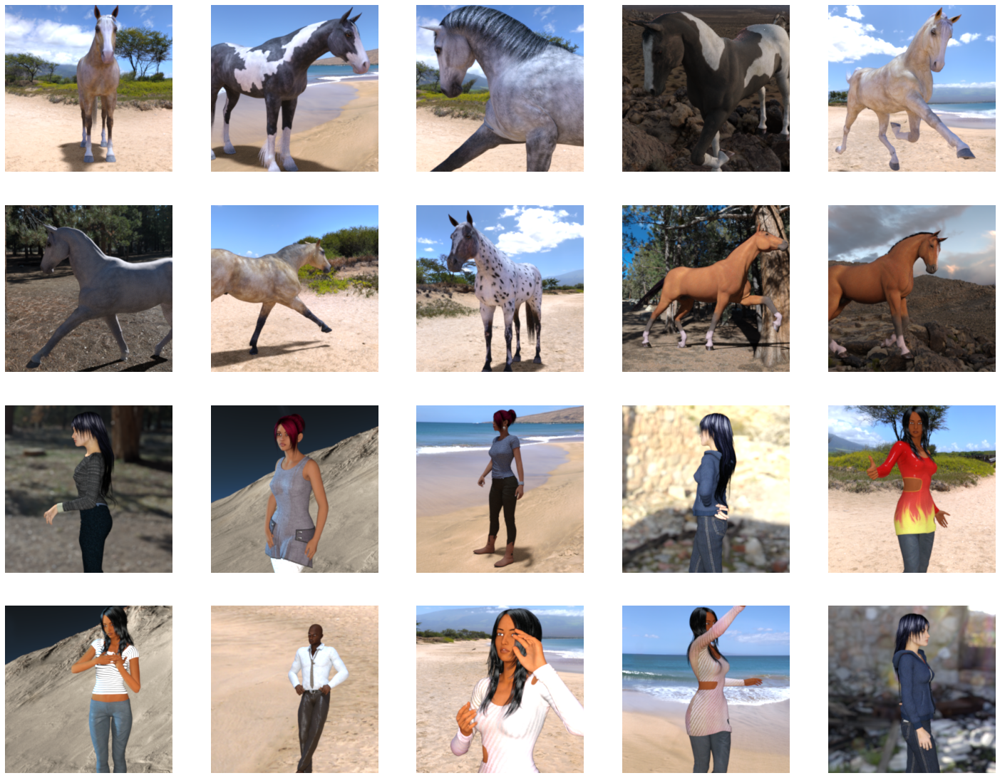
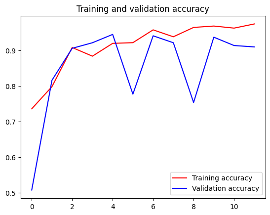
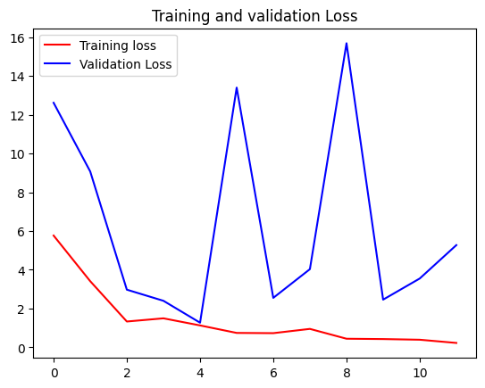

# Transfer-Learning-for-binary-classification
## Aim
To Implement Transfer Learning for Horses_vs_humans dataset classification using InceptionV3 architecture.
## Problem Statement and Dataset
The objective of this project is to classify images from the Horses vs. Humans dataset using the InceptionV3 architecture through transfer learning. This dataset presents a binary classification challenge, distinguishing between images of horses and humans. By leveraging pre-trained weights from the InceptionV3 model, we aim to enhance classification accuracy and reduce training time. The project will evaluate the model's performance based on metrics such as accuracy, precision, and recall. Ultimately, the goal is to demonstrate the effectiveness of transfer learning in image classification tasks.

</br>
</br>
</br>

## DESIGN STEPS
### STEP 1:
Import necessary libraries and load the InceptionV3 model with pre-trained weights, excluding the top layer, while freezing its layers.

### STEP 2:
Define the model architecture by adding a flattening layer, a dense layer with ReLU activation, a dropout layer, and a final sigmoid layer for binary classification.

### STEP 3:
Compile the model with the RMSprop optimizer, binary crossentropy loss, and accuracy as the metric.

### STEP 4:
Load and preprocess the Horses vs. Humans dataset, applying data augmentation for the training set and creating data generators for training and validation.

### STEP 5:
Train the model using the training dataset with a custom callback to stop training when accuracy exceeds 97%, and visualize the training and validation metrics.
<br/>

## PROGRAM
```
Name : Sam Israel D
Reg. No : 212222230128
```
#### Import all the necessary files!
```python
import os
import tensorflow as tf
from tensorflow.keras import layers
from tensorflow.keras import Model
```
#### Import the inception model
```python
from tensorflow.keras.applications.inception_v3 import InceptionV3
```
#### Create an instance of the inception model from the local pre-trained weights
```python
local_weights_file = path_inception

pre_trained_model = InceptionV3(include_top = False,
                                input_shape = (150, 150, 3),
                                weights = None)

pre_trained_model.load_weights(local_weights_file)
```
#### Make all the layers in the pre-trained model non-trainable
```python
for layer in pre_trained_model.layers:
    layer.trainable = False
```
#### Print the model summary
```python
pre_trained_model.summary()
last_layer = pre_trained_model.get_layer('mixed7')
print('last layer output shape: ', last_layer.output.shape)
last_output = last_layer.output
```
#### Define a Callback class that stops training once accuracy reaches 97.0%
```python
class myCallback(tf.keras.callbacks.Callback):
    def on_epoch_end(self, epoch, logs=None):
        if logs['accuracy']>0.97:
            self.model.stop_training = True
            print("\nReached 97.0% accuracy so cancelling training!")
```
#### Train & compile the model
```python
from tensorflow.keras.optimizers import RMSprop
# Flatten the output layer of the pretrained model to 1 dimension
x = tf.keras.layers.Flatten()(last_output)
# Add a fully connected layer with 1024 hidden units and ReLU activation
x = tf.keras.layers.Dense(1024, activation='relu')(x)
# Add a dropout rate of 0.2
x = tf.keras.layers.Dropout(0.2)(x)  
# Add a final sigmoid layer for classification
x = tf.keras.layers.Dense(1, activation='sigmoid')(x)  
model = Model(pre_trained_model.input, outputs = x)

model.compile( 
        optimizer=tf.keras.optimizers.RMSprop(learning_rate=0.00001), 
        loss='binary_crossentropy', # use a loss for binary classification
        metrics=['accuracy'] 
    )
```
#### Get the datasets
```python
# Get the Horse or Human dataset
path_horse_or_human = './horse-or-human.zip'
# Get the Horse or Human Validation dataset
path_validation_horse_or_human = './validation-horse-or-human.zip'

import os
import zipfile

local_zip = path_horse_or_human
zip_ref = zipfile.ZipFile(local_zip, 'r')
zip_ref.extractall('/tmp/training')
zip_ref.close()

local_zip = path_validation_horse_or_human
zip_ref = zipfile.ZipFile(local_zip, 'r')
zip_ref.extractall('/tmp/validation')
zip_ref.close()
```
#### Define our example directories and files
```python
# Define our example directories and files
train_dir = '/tmp/training'
validation_dir = '/tmp/validation'

train_horses_dir = os.path.join(train_dir, 'horses')
train_humans_dir = os.path.join(train_dir, 'humans')
validation_horses_dir = os.path.join(validation_dir, 'horses')
validation_humans_dir = os.path.join(validation_dir, 'humans')

train_horses_fnames = os.listdir(train_horses_dir)
train_humans_fnames = os.listdir(train_humans_dir)
validation_horses_fnames = os.listdir(validation_horses_dir)
validation_humans_fnames = os.listdir(validation_humans_dir)

print(len(train_horses_fnames))
print(len(train_humans_fnames))
print(len(validation_horses_fnames))
print(len(validation_humans_fnames))

```
#### Add data-augmentation parameters to ImageDataGenerator
```python

train_datagen = ImageDataGenerator(rescale = 1/255,
                                  height_shift_range = 0.2,
                                  width_shift_range = 0.2,
                                  horizontal_flip = True,
                                  vertical_flip = True,
                                  rotation_range = 0.4,
                                  shear_range = 0.1,
                                  zoom_range = 0.3,
                                  fill_mode = 'nearest'
                                  )
# Note that the validation data should not be augmented!
test_datagen = ImageDataGenerator(rescale = 1/255)

# Flow training images in batches of 20 using train_datagen generator
train_generator = train_datagen.flow_from_directory(train_dir,
                                                   target_size = (150, 150),
                                                   batch_size = 20,
                                                   class_mode = 'binary',
                                                   shuffle = True)

# Flow validation images in batches of 20 using test_datagen generator
validation_generator =  test_datagen.flow_from_directory(validation_dir,
                                                        target_size = (150, 150),
                                                        batch_size =20,
                                                        class_mode = 'binary',
                                                        shuffle = False)

```
#### Utilising image_dataset_from_directory API
```python
training_dataset = tf.keras.utils.image_dataset_from_directory( 
    directory=train_dir,
    batch_size=32,
    image_size=(150, 150),
    shuffle=True, 
    seed=7 
) 

validation_dataset = tf.keras.utils.image_dataset_from_directory( 
    directory=validation_dir,
    batch_size=32,
    image_size=(150, 150),
    shuffle=True, 
    seed=7 
) 
```
#### Fit the model
```python
callbacks = myCallback()
history = model.fit(
    training_dataset,
    validation_data = validation_dataset,
    epochs = 100,
    verbose = 2,
    callbacks = [myCallback()],
)
```
#### Plotting Training VS Validation accuracy & loss
```python
import matplotlib.pyplot as plt
acc = history.history['accuracy']
val_acc = history.history['val_accuracy']
loss = history.history['loss']
val_loss = history.history['val_loss']

epochs = range(len(acc))

plt.plot(epochs, acc, 'r', label='Training accuracy')
plt.plot(epochs, val_acc, 'b', label='Validation accuracy')
plt.title('Name:           Register Number:      ')
plt.title('Training and validation accuracy')
plt.legend(loc=0)
plt.figure()
plt.plot(epochs, loss, 'r', label='Training loss')
plt.plot(epochs, val_loss, 'b', label='Validation Loss')
plt.title('Name:           Register Number:      ')
plt.title('Training and validation Loss')
plt.legend(loc=0)
plt.figure()


plt.show()
```

## OUTPUT
### Training Accuracy, Validation Accuracy Vs Iteration Plot

</br>
</br>
</br>

### Training Loss, Validation Loss Vs Iteration Plot

</br>
</br>
</br>

### Conclusion
This code implements transfer learning using a pre-trained InceptionV3 model for binary image classification. By freezing the model's layers and adding custom layers for specific classification tasks, it leverages previously learned features, resulting in faster training and improved accuracy compared to training from scratch. Data augmentation further enhances model generalization by providing varied training samples. A custom callback stops training when the accuracy reaches 97%, optimizing training time. Overall, this approach combines the strengths of pre-trained models with effective data handling, making it efficient for the task at hand.

## RESULT

Thus, the Transfer Learning for Horses_vs_humans dataset classification using InceptionV3 architecture has been implemented successfully.
